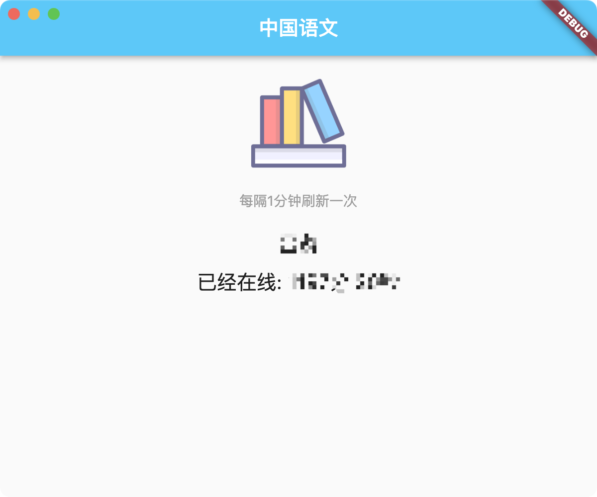

# 武汉理工大学中国语文刷时长工具

使用Flutter Desktop搭建

## 使用方式

[点击下载压缩包](https://github.com/kcqnly/whut_zgyw/releases/download/v1.0.0/win-release.zip)

解压后双击exe运行

## 功能说明

- 每隔一分钟刷新在线时长
- 关闭窗口后可通过状态栏重新打开，期间仍在刷新时长
- 可通过状态栏图标重新登录账号，或完全退出应用
